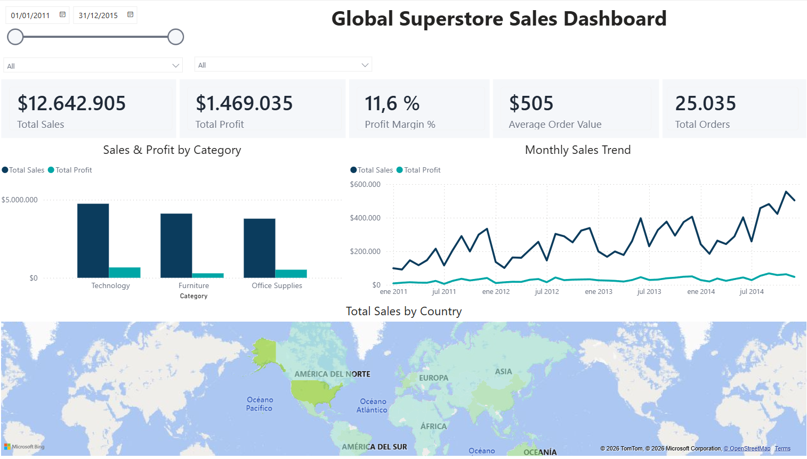

# Global Superstore Sales Dashboard

An interactive Power BI dashboard analyzing four years of global retail sales — built to answer the questions a sales or finance leader would actually ask: where is the business winning, where is it losing margin, and what should happen next.

**[Explore the live interactive dashboard →](https://app.powerbi.com/view?r=eyJrIjoiNTc4Njk0ZDAtZTc4OC00NWEzLWIxOWYtNzVjY2Q1Y2QyYmFiIiwidCI6Ijk5ZTFlNzIxLTcxODQtNDk4ZS04YWZmLWIyYWQ0ZTUzYzFjMiIsImMiOjR9)**

## Business Questions This Dashboard Answers

- Which product categories drive revenue — and are they the same ones driving profit?
- How has sales performance trended over the last four years, and is there a seasonal pattern worth planning around?
- Which countries carry the most weight in global sales, and how concentrated is that reliance?
- What do the underlying unit economics say about the overall health of the business?

## Key Results

| Metric | Value |
|---|---|
| Total Sales | $12,642,905 |
| Total Profit | $1,469,035 |
| Profit Margin | 11.6% |
| Total Orders | 25,035 |
| Average Order Value | $505 |

Based on 51,290 order line items spanning January 2011 to December 2014, across multiple global markets.

## Business Insights

**1. Furniture's margin problem looks structural, not seasonal.**
Furniture sells nearly as much as Technology, but its profit bar is visibly the thinnest of the three categories — a "sells well, earns little" pattern. That points to a discounting problem specific to Furniture, not a demand problem: the products are moving, the margin isn't following them.

**2. Revenue is concentrated in one country — a risk, not just a fact.**
The country map shows the United States as the clear single largest contributor to global sales, with every other country trailing well behind individually. For a business with genuinely global reach, that concentration is worth flagging to leadership: a slowdown in one market would have an outsized effect on the whole company.

**3. Growth is real, and so is the seasonality.**
Monthly sales trend upward from 2011 to 2014, with a recurring spike near the end of each year — consistent with holiday-season demand. That's a predictable cycle the business could plan inventory and staffing around, instead of reacting to it every time.

**4. Unit economics are stable but unremarkable.**
An 11.6% margin and a $505 average order value describe a business that's healthy, not optimized. There's visible room to improve profitability — starting with Furniture's discounting — without needing to grow revenue at all.

## How It Was Built

- **Data cleaning (Power Query):** the source file mixed regional conventions — DD/MM/YYYY dates alongside English-style decimal numbers — so column types were converted with explicit locale settings instead of relying on auto-detection. Final KPI totals were independently cross-checked in Excel.
- **Data model:** a dedicated calendar table (DAX `CALENDARAUTO`) supports time intelligence and correct chronological sorting, kept separate from the fact table.
- **DAX measures:** Total Sales, Total Profit, Profit Margin %, Total Orders (`DISTINCTCOUNT`), and Average Order Value, organized in their own measures table.
- **Visuals:** KPI cards, a side-by-side sales-vs-profit comparison by category, a monthly trend line, and a filled world map by country.
- **Interactivity:** slicers for date range, category, and market, so the dashboard can be filtered rather than just viewed.
- **Published live** via Power BI Service (Publish to Web), so it can be explored directly rather than viewed as a static image.

## Dataset

Global Superstore (Kaggle) — 51,290 order line items across four years and dozens of countries, covering sales, profit, discount, and shipping cost by category, market, and customer segment.

## Tools

Power BI Desktop · Power Query (M) · DAX · Power BI Service

---

**María Andrea Hernández Arias**
Part of a six-project data analytics portfolio → [hernandez484.github.io](https://hernandez484.github.io) · [GitHub](https://github.com/Hernandez484)
